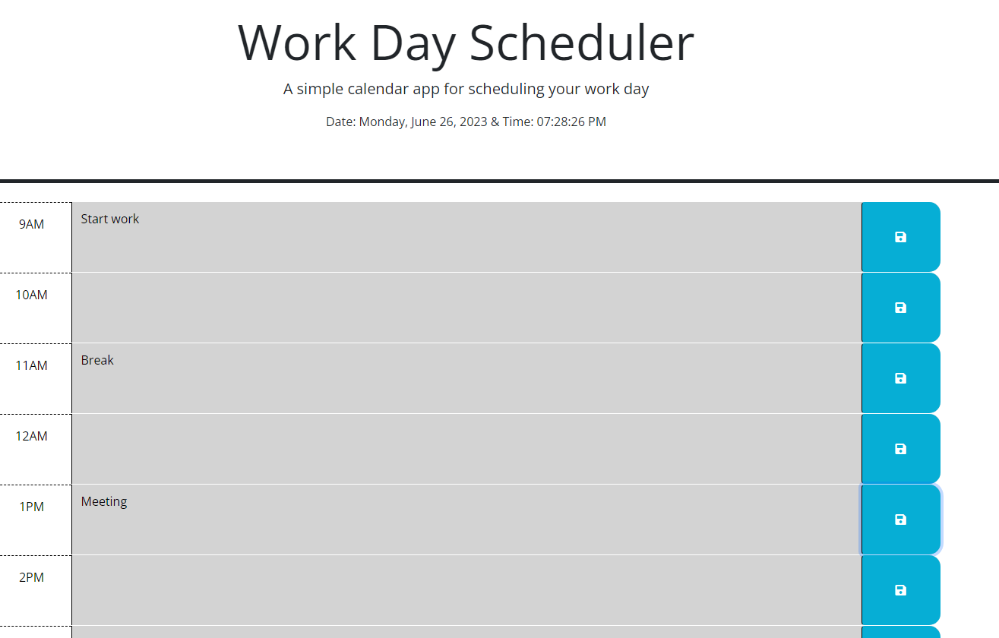

# WorkDayCalender-Challenge5-ThirdPartyAPIs

<h2>Project Description - For bootcamp challenge 5:<h2> 

<h3>Project 5 is an on call challenge in which we are to fix/make a work day schedule through hours 9am-5pm utilising mainly JS. The project is colour coded based on current time and has a functional clock at the top as well as features to save inputs into the textarea to local storage.<h3>

<h2>No installation is required.<h2>

<h2>Additional Credits - University of Sydney bootcamp for providing the basic framework for the project<h2>

<h2>How to use:<h2>

<h3>The project is based around launching a static webpage that has a functional schedule which can be saved and customised. Write your notes in the textarea and press save to keep your input there, grey means that time has already passed, red is present hour and green is future hours to come for the day.<h3>

<h2>License - [MIT License](LICENSE) <h2>
<h3>Refer to license to see permissions<h3>

<h2>Website link: https://bemonn.github.io/WorkDayCalender-Challenge5-ThirdPartyAPIs/ 
<h2>

<h2> Schedule in use: <h2>

